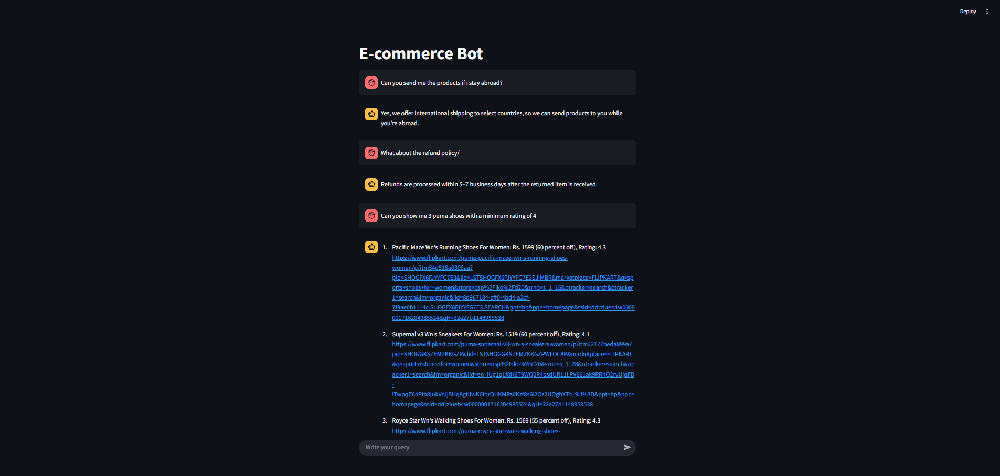

# Generative AI Mock Chatbot  
> An AI-powered chatbot with **FAQ answering** and **product database querying** built using **ChromaDB**, **Groq Cloud**, and **Streamlit**.  

  
  
  

---

## Overview

This project is a **Generative AI-powered chatbot** that demonstrates two different conversation flows:

- **FAQ Bot** → Answers general frequently asked questions from a CSV file.  
- **Women’s Sports Shoes Bot** → Queries a SQLite database (scraped from Flipkart) to answer questions about women’s sports shoes (brand, rating, price, discount).  

Here’s what the app looks like:  

  

---

## Features

- **FAQ Pipeline (`faq.py`)**
  - Ingests FAQ data from CSV into **ChromaDB**.
  - Uses **Hugging Face Sentence Transformer** for embeddings.
  - Retrieves the most relevant response by semantic similarity.
  - Passes results through an **LLM (OpenAI)** for natural language generation.

- **SQL Pipeline (`sql.py`)**
  - Converts natural language into structured **SQL queries**.
  - Executes queries on the **SQLite database** of women’s shoes.
  - Rephrases raw results into **human-like responses**.

- **Router (`router.py`)**
  - Routes queries to the correct pipeline (FAQ or SQL).  

- **Frontend (`main.py`)**
  - A **Streamlit app** providing a chatbot-like UI.

---

## Tech Stack

- **Datastore**: [ChromaDB](https://www.trychroma.com/)  
- **LLM Client**: [Groq Cloud](https://groq.com/)  
- **Embeddings**: [Hugging Face Sentence Transformers](https://www.sbert.net/)  
- **Language Model**: OpenAI GPT  
- **Frontend**: [Streamlit](https://streamlit.io/)  
- **Data Storage**:  
  - `faq.csv` → FAQ knowledge base  
  - `sqlite.db` → SQLite DB of women’s sports shoes  

---

## Project Structure
1. faq.py # Handles FAQ ingestion and question answering
1. sql.py # Handles SQL query generation and human-readable responses 
1. router.py # Routes queries between FAQ and SQL pipelines 
1. main.py # Streamlit UI 
1. Data: 
- faq.csv # FAQ dataset 
- sqlite.db # SQLite database with product info 
6. README.md # Project documentation 
7. requirements.txt


---

## Getting Started

### 1️. Clone the repository
```bash
git clone https://github.com/jatin-30/genai-chatbot.git
cd genai-chatbot
```

### 2️. Create a virtual environment
```bash
python -m venv venv
source venv/bin/activate   # On Mac/Linux
venv\Scripts\activate      # On Windows
```

### 3. Install dependencies
```bash
pip install -r requirements.txt
```

### 4. Set environment variables
Create a .env file in the project root:
```bash
GROQ_API_KEY = your_groq_api_key
GROQ_MODEL = your_groq_model
```
###  5. Run the Streamlit app
```bash
streamlit run main.py
```


